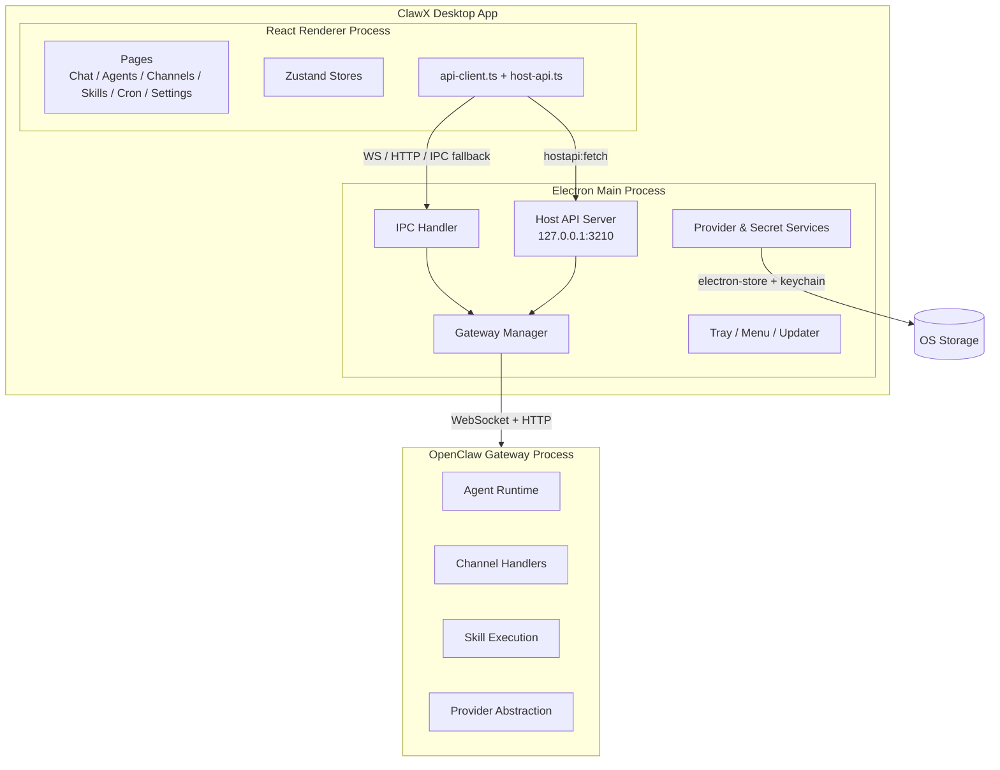
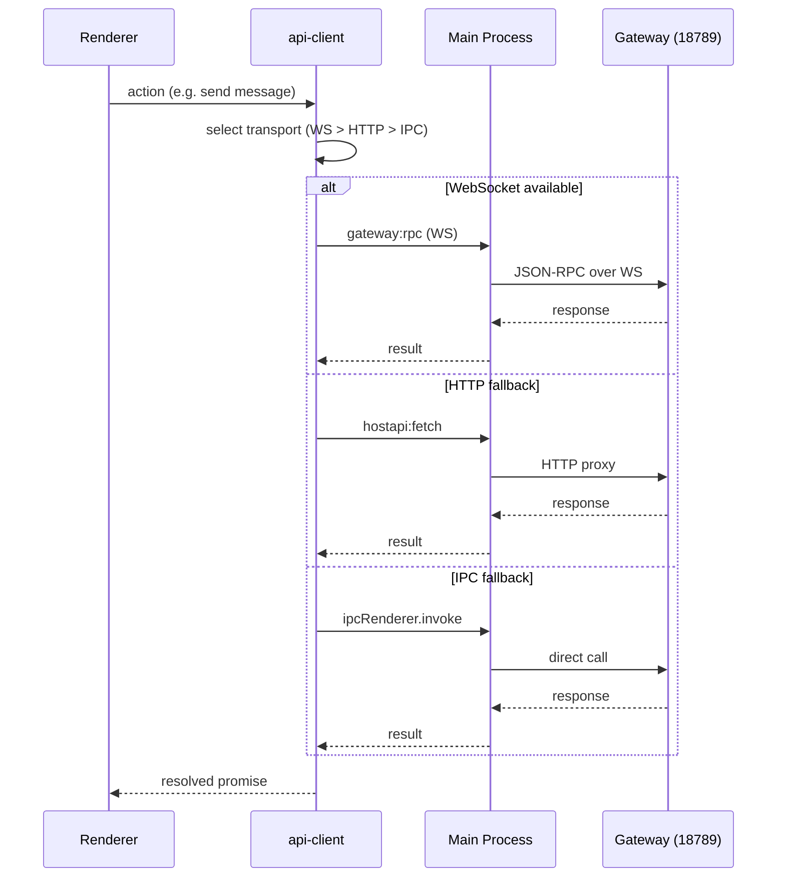
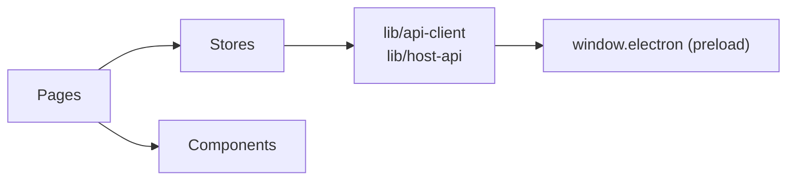
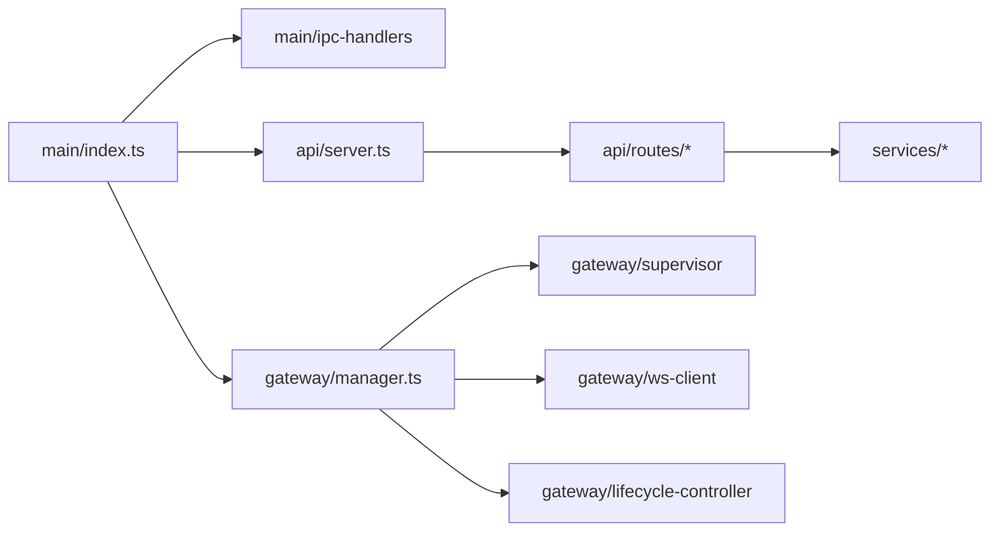

# Architecture

High-level system design, boundaries, and key decisions for ClawX.

<!-- SpecDriven:managed:start -->

## System Overview

ClawX is a cross-platform **Electron desktop application** that provides a graphical interface for the [OpenClaw](https://github.com/OpenClaw) AI agent runtime. It manages the full lifecycle of AI agents, providers, channels, skills, and scheduled tasks through a dual-process architecture.

## Process Model

### Electron Main Process

The authoritative control plane. Responsibilities:

- **Window & lifecycle management**: single-instance lock, tray, quit lifecycle
- **Host API server**: native Node.js HTTP server on `127.0.0.1:3210` with chain-of-responsibility routing
- **Gateway supervision**: launch, monitor, reconnect, and gracefully stop the OpenClaw child process
- **Service layer**: provider registry, secret storage (OS keychain + electron-store), config sync
- **IPC bridge**: preload-script exposes whitelisted channels via `contextBridge`

### React Renderer Process

The user-facing UI. Responsibilities:

- **Pages**: Setup, Chat, Agents, Channels, Skills, Cron, Models, Settings
- **State management**: domain-specific Zustand stores (settings, gateway, chat, providers, agents, channels, skills, cron, update)
- **API abstraction**: all backend calls via `api-client.ts` / `host-api.ts` — never direct IPC or HTTP to Gateway

### OpenClaw Gateway Process

Managed child process running on port `18789`. Responsibilities:

- AI agent runtime and orchestration
- Message channel management (Telegram, WhatsApp, DingTalk, Lark, WeCom, QQBot, etc.)
- Skill and plugin execution
- Provider abstraction for 12+ AI providers

## Communication Architecture

### Transport Policy

- **Owned by Main process** — Renderer never implements protocol switching.
- **Fixed fallback order**: WS → HTTP → IPC.
- **Backoff**: failed transports enter a cooldown before retry.
- **CORS-safe**: all local HTTP proxied through Main; Renderer never calls `127.0.0.1:18789` directly.

### IPC Security

The preload script ([electron/preload/index.ts](electron/preload/index.ts)) whitelists every valid channel. Renderer code can only use channels explicitly listed in the `validChannels` arrays. ESLint custom rules enforce that `src/` code uses `invokeIpc` from `api-client` rather than raw `window.electron.ipcRenderer.invoke`.

## Key Boundaries

| Boundary | Rule |
|----------|------|
| Renderer → Main | Via `api-client.ts` / `host-api.ts` only |
| Main → Gateway | WS, HTTP proxy, or direct spawn IPC |
| Renderer → Gateway | **Forbidden** — all proxied through Main |
| Secrets | OS keychain + encrypted electron-store; never exposed to Renderer raw |
| Config | `electron-store` JSON files; no database |

## Data Storage

| Data | Storage | Location |
|------|---------|----------|
| App settings | electron-store | OS app data directory |
| Provider secrets | electron-store + OS keychain | OS app data + system keychain |
| Session transcripts | `.jsonl` files | OpenClaw config directory |
| Token usage | Parsed from transcript `.jsonl` | Aggregated at read-time |
| Skills | Filesystem | `~/.openclaw/skills/` (managed) |

## Module Architecture

### Renderer Modules

- **Pages**: top-level route components (Chat, Agents, Channels, Skills, Cron, Models, Settings, Setup)
- **Stores**: Zustand stores, one per domain
- **Components**: ui/ (shadcn/ui primitives), layout/, settings/, channels/, common/
- **Lib**: API client, host-api, error model, gateway-client, host-events, telemetry, utils

### Main Process Modules

- **Gateway subsystem**: manager, supervisor, process-launcher, ws-client, connection-monitor, restart-controller, restart-governor, reload-policy, startup-orchestrator, startup-recovery, state
- **API routes**: agents, app, channels, cron, files, gateway, logs, providers, sessions, settings, skills, usage
- **Services**: provider-service, provider-store, provider-validation, provider-migration, provider-runtime-sync, secret-store

## Architecture Decisions

### No Database

The app uses `electron-store` (JSON files) and the OS keychain. This keeps the installation footprint minimal and avoids requiring a database server. Token usage is aggregated at read-time from OpenClaw `.jsonl` transcript files.

### Embedded OpenClaw Runtime

Instead of requiring an external OpenClaw installation, ClawX bundles the runtime as an `extraResource`. The Gateway Manager spawns it as a child process and manages its full lifecycle (start, health check, reconnect, graceful stop).

### GPU Acceleration Disabled

Hardware GPU acceleration is disabled by default (`app.disableHardwareAcceleration()`) for maximum stability across all GPU configurations. This follows VS Code's approach — software rendering is deterministic across vendors. Users can re-enable with `--enable-gpu`.

### Single-Instance Protection

Electron's single-instance lock plus a filesystem-level fallback lock prevent duplicate app launches. Without this, two instances would each spawn a Gateway on the same port, causing an infinite kill/restart loop on Windows.

### Provider Registry Pattern

All 12+ AI providers (Anthropic, OpenAI, Google, OpenRouter, ByteDance Ark, Moonshot, SiliconFlow, MiniMax, Qwen, Ollama, Custom) are defined in a declarative registry ([electron/shared/providers/registry.ts](electron/shared/providers/registry.ts)) with auth modes, protocols, and default configurations. This enables the UI to render provider forms dynamically.

For code conventions, see [STYLEGUIDE.md](STYLEGUIDE.md). For testing strategy, see [TESTING.md](TESTING.md).

<!-- SpecDriven:managed:end -->
