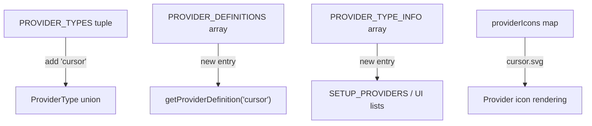
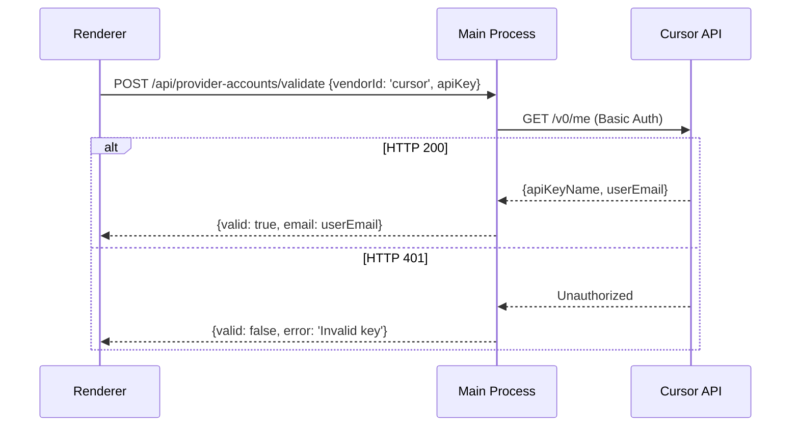
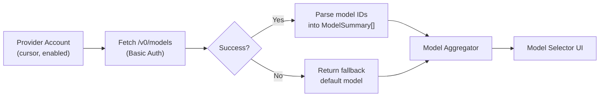
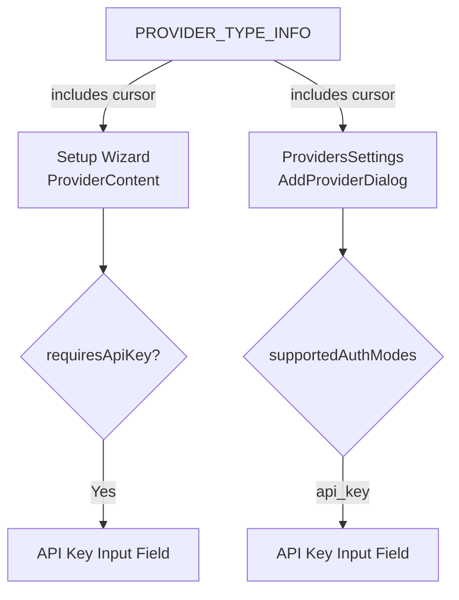
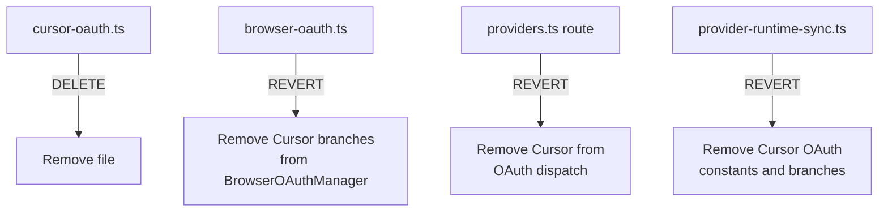
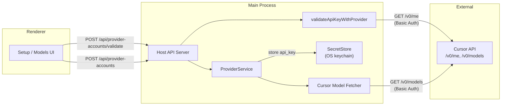
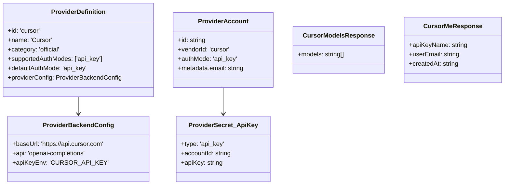

# Design Document

## Overview

This design adds Cursor as a new official AI provider in ClawX. The implementation follows the established provider architecture: a static registration entry in the backend registry and its frontend mirror, an API-key validation path reusing the existing `validateApiKeyWithProvider` infrastructure, and dynamic model fetching via the Cursor API `/v0/models` endpoint.

The Cursor provider uses the `openai-completions` protocol and `https://api.cursor.com` as its base URL. Authentication uses `api_key` as the sole mode — consistent with Cursor's official API documentation, which requires HTTP Basic Authentication (`Authorization: Basic {base64(apiKey + ':')}`). No OAuth flow is supported or needed. The implementation reuses the existing secret storage, provider service, and IPC mechanisms — no new transport or IPC channels are required.

### Change Type

new-feature

### Design Goals

1. Add Cursor provider registration following the same patterns as existing API-key-only official providers.
2. Expose Cursor in both the onboarding setup wizard and the Models management screen with zero changes to shared UI components.
3. Validate credentials using the Cursor API `GET /v0/me` endpoint with HTTP Basic Authentication.
4. Dynamically fetch available models from the Cursor API `GET /v0/models` endpoint.

### References

- **REQ-1**: Cursor provider registration
- **REQ-2**: Cursor provider in onboarding setup
- **REQ-3**: Cursor provider in Models management screen
- **REQ-4**: Cursor API key authentication
- **REQ-5**: Cursor model listing
- **REQ-6**: Cursor credential validation
- **REQ-7**: Cursor provider icon

## System Architecture

### DES-1: Cursor provider definition

The Cursor provider is added as a new entry in both the backend `PROVIDER_DEFINITIONS` array (in `electron/shared/providers/registry.ts`) and the frontend `PROVIDER_TYPE_INFO` array (in `src/lib/providers.ts`). The type literal `'cursor'` is appended to the `PROVIDER_TYPES` and `BUILTIN_PROVIDER_TYPES` const tuples in both `electron/shared/providers/types.ts` and `src/lib/providers.ts`.

Backend definition properties:
- `id: 'cursor'`, `name: 'Cursor'`, `category: 'official'`
- `supportedAuthModes: ['api_key']`, `defaultAuthMode: 'api_key'`
- `isOAuth: false`, `supportsApiKey: true`, `requiresApiKey: true`
- `envVar: 'CURSOR_API_KEY'`, `defaultModelId: 'claude-4-sonnet-thinking'`
- `providerConfig.baseUrl: 'https://api.cursor.com'`, `providerConfig.api: 'openai-completions'`

A corresponding SVG icon file is added to `src/assets/providers/cursor.svg` and registered in the `providerIcons` map.

_Implements: REQ-1.1, REQ-1.2, REQ-1.3, REQ-2.1, REQ-3.1, REQ-7.1, REQ-7.2_

### DES-2: Cursor API key validation

API key validation for Cursor reuses the existing `validateApiKeyWithProvider()` function in the providers route. A Cursor-specific validation handler:

1. Calls `GET https://api.cursor.com/v0/me` with HTTP Basic Auth (`Authorization: Basic {base64(apiKey + ':')}`).
2. On HTTP 200, returns `{ valid: true, email: response.userEmail }`.
3. On HTTP 401/403, returns `{ valid: false, error: 'Invalid or expired API key' }`.

This handler is registered in the validation dispatcher that `validateApiKeyWithProvider()` uses, keyed to the `'cursor'` provider type.

_Implements: REQ-4.1, REQ-4.2, REQ-4.3, REQ-6.1, REQ-6.2, REQ-6.3_

### DES-3: Cursor dynamic model listing

A model-fetching function is added to the provider service layer that:

1. Calls `GET https://api.cursor.com/v0/models` using the stored Cursor API key (resolved from `SecretStore`) with HTTP Basic Authentication.
2. Parses the response `{ models: string[] }` into `ModelSummary[]` entries with `source: 'remote'` and `vendorId: 'cursor'`.
3. Caches the result for a configurable TTL (e.g. 15 minutes) to avoid excessive API calls.
4. On failure, returns a fallback array containing the `defaultModelId` (`claude-4-sonnet-thinking`).

This integrates with the existing model aggregation pipeline that merges models from all enabled providers into the model selector.

_Implements: REQ-5.1, REQ-5.2, REQ-5.3_

### DES-4: Onboarding and Models screen integration

No new UI components are needed. The existing provider selection in the Setup wizard (`src/pages/Setup/index.tsx`) iterates over `SETUP_PROVIDERS` (which equals `PROVIDER_TYPE_INFO`). Adding Cursor to that array automatically surfaces it in the wizard. The same applies to `ProvidersSettings.tsx` (used by both the Models page and Settings), which reads provider definitions from the Zustand store populated by the vendor list API.

Since Cursor is an API-key-only provider (`requiresApiKey: true`, `isOAuth: false`), the Setup wizard renders a standard API key input field — matching the pattern of providers like Anthropic or Mistral. A helper link to the Cursor Dashboard is included alongside the input field.

_Implements: REQ-2.1, REQ-2.2, REQ-2.3, REQ-3.1, REQ-3.2, REQ-3.3_

### DES-5: OAuth cleanup

Since Cursor uses only API key authentication, the following OAuth artifacts added in the initial implementation must be removed:

1. **Delete `electron/utils/cursor-oauth.ts`** — the entire file implementing `loginCursorOAuth()` with PKCE, local callback server, and token exchange.
2. **Revert `electron/utils/browser-oauth.ts`** — remove `'cursor'` from `BrowserOAuthProviderType` union, remove `loginCursorOAuth`/`CursorOAuthCredentials` imports, remove `CURSOR_RUNTIME_PROVIDER_ID` and `CURSOR_OAUTH_DEFAULT_MODEL` constants, remove Cursor branches in `executeFlow()` and `onSuccess()`.
3. **Revert `electron/api/routes/providers.ts`** — remove `|| body.provider === 'cursor'` from the OAuth dispatch condition.
4. **Revert `electron/services/providers/provider-runtime-sync.ts`** — remove `CURSOR_OAUTH_RUNTIME_PROVIDER` and `CURSOR_OAUTH_DEFAULT_MODEL_REF` constants, remove Cursor branches in `getBrowserOAuthRuntimeProvider()` and `syncDefaultProviderToRuntime()`.

_Implements: REQ-1.2 (api_key as sole mode)_

## Data Flow

## Code Anatomy

| File Path | Purpose | Implements |
|-----------|---------|------------|
| electron/shared/providers/types.ts | Add `'cursor'` to `PROVIDER_TYPES` and `BUILTIN_PROVIDER_TYPES` tuples | DES-1 |
| electron/shared/providers/registry.ts | Add Cursor entry to `PROVIDER_DEFINITIONS` array (api_key only) | DES-1 |
| src/lib/providers.ts | Add `'cursor'` to frontend type tuples and `PROVIDER_TYPE_INFO` array (requiresApiKey: true) | DES-1 |
| src/assets/providers/cursor.svg | Cursor provider icon | DES-1 |
| src/assets/providers/index.ts | Register cursor icon in `providerIcons` map | DES-1 |
| electron/services/providers/provider-validation.ts | Cursor-specific validation handler calling `/v0/me` with Basic Auth | DES-2 |
| electron/services/providers/cursor-models.ts | Fetch and cache Cursor models from `/v0/models` endpoint with Basic Auth | DES-3 |
| electron/utils/cursor-oauth.ts | **DELETE** — OAuth implementation not needed | DES-5 |
| electron/utils/browser-oauth.ts | **REVERT** — Remove Cursor from BrowserOAuthProviderType and all Cursor branches | DES-5 |
| electron/api/routes/providers.ts | **REVERT** — Remove Cursor from OAuth dispatch condition | DES-5 |
| electron/services/providers/provider-runtime-sync.ts | **REVERT** — Remove Cursor OAuth constants and branches | DES-5 |
| src/pages/Setup/index.tsx | No code changes — Cursor appears automatically via `SETUP_PROVIDERS` | DES-4 |
| src/components/settings/ProvidersSettings.tsx | No code changes — Cursor appears automatically via vendor list | DES-4 |

## Data Models

## Error Handling

| Error Condition | Response | Recovery |
|-----------------|----------|----------|
| Cursor API key invalid (401) | Return `{valid: false}` with error message | User corrects the API key |
| Cursor API key requires enterprise (403) | Return `{valid: false}` with permission error | User upgrades plan or contacts admin |
| Rate limited (429) | Return error with retry-after hint | User waits and retries |
| `/v0/models` fetch failure | Return fallback default model, log error | User can still use the default model |
| Network timeout | Return error with connectivity message | User checks network and retries |

## Impact Analysis

| Affected Area | Impact Level | Notes |
|---------------|--------------|-------|
| electron/shared/providers/types.ts | Medium | Type union expands — all exhaustive switch/if-else on `ProviderType` must handle `'cursor'` or use default branches |
| electron/utils/browser-oauth.ts | Medium | Revert Cursor additions — remove union member and all Cursor branches |
| electron/utils/cursor-oauth.ts | High | Delete entire file — OAuth implementation is invalid for Cursor |
| electron/api/routes/providers.ts | Low | Remove Cursor from OAuth dispatch condition |
| electron/services/providers/provider-runtime-sync.ts | Medium | Remove Cursor OAuth constants and sync branches |
| src/lib/providers.ts | Medium | Frontend type union and metadata array — set `requiresApiKey: true`, no `isOAuth` |
| src/assets/providers/ | Low | SVG file and map entry (already correct) |

### Testing Requirements

| Test Type | Coverage Goal | Notes |
|-----------|---------------|-------|
| Unit | Cursor definition lookup | Verify `getProviderDefinition('cursor')` returns expected shape with `api_key` only |
| Unit | API key validation | Mock `/v0/me` responses (200, 401, 403) and verify return values |
| Unit | Model fetching | Mock `/v0/models` and verify `ModelSummary[]` output and error fallback |
| Unit | No OAuth | Verify `BrowserOAuthProviderType` does not include `'cursor'` |
| E2E | Setup wizard | Verify Cursor appears in provider list with API key input (no OAuth button) |

## Traceability Matrix

| Design Element | Requirements |
|----------------|--------------|
| DES-1 | REQ-1.1, REQ-1.2, REQ-1.3, REQ-2.1, REQ-3.1, REQ-7.1, REQ-7.2 |
| DES-2 | REQ-4.1, REQ-4.2, REQ-4.3, REQ-6.1, REQ-6.2, REQ-6.3 |
| DES-3 | REQ-5.1, REQ-5.2, REQ-5.3 |
| DES-4 | REQ-2.1, REQ-2.2, REQ-2.3, REQ-3.1, REQ-3.2, REQ-3.3 |
| DES-5 | REQ-1.2 |
