# Design Document

## Overview

This design adds GitHub Copilot as a new provider in ClawX, following the existing provider registration architecture. The Copilot provider uses `oauth_browser` authentication via GitHub's OAuth Device Flow and targets the Copilot Chat Completions API (`https://api.githubcopilot.com`), which follows the OpenAI Completions protocol.

The design extends three layers: (1) the shared provider registry and types to include `github-copilot` as a new `ProviderType`, (2) a new `github-copilot-oauth.ts` utility implementing the GitHub Device Flow OAuth in the Main process, integrated into the existing `BrowserOAuthManager`, and (3) the frontend provider lists and icon assets. All changes follow existing patterns — no new abstractions or communication channels are introduced.

The `CopilotModelSelector` component renders in **both view mode and edit mode** of the provider card, showing available models in a flat list with the active model highlighted.

The initial implementation included a `CopilotModelEntry` type with tier classification (`free`/`premium`), a `classifyModelTier()` function, `modelTiers` metadata storage, and tier-grouped UI with badges. This design also covers the explicit removal of all tier-related artifacts (DES-8), since the Copilot API does not expose tier or multiplier metadata.

### Change Type

enhancement

### Design Goals

1. Register GitHub Copilot as a provider using the existing declarative registry pattern
2. Implement GitHub OAuth using the Device Flow (RFC 8628), reusing the existing `BrowserOAuthManager` lifecycle
3. Fetch and store available models from the Copilot API
4. Display models in a flat list in the provider card, available in both view and edit modes
5. Ensure the provider integrates seamlessly into Settings Add Provider dialog and onboarding Setup wizard without special-case UI code
6. Remove all tier classification code, types, and UI elements from the existing implementation

### References

- **REQ-1**: Copilot provider registration
- **REQ-2**: GitHub OAuth authentication
- **REQ-3**: Copilot model discovery
- **REQ-4**: Copilot provider lifecycle
- **REQ-5**: Onboarding setup integration
- **REQ-6**: Model selector display
- **REQ-7**: Tier classification removal

## System Architecture

### DES-1: Provider type and registry entry

Add `'github-copilot'` to the `PROVIDER_TYPES` and `BUILTIN_PROVIDER_TYPES` arrays in `electron/shared/providers/types.ts`, and add a corresponding `ProviderDefinition` entry in `electron/shared/providers/registry.ts`. The frontend mirror in `src/lib/providers.ts` receives a matching `ProviderTypeInfo` entry.

The registry entry uses:
- `supportedAuthModes: ['oauth_browser']` (OAuth only, no API key)
- `defaultAuthMode: 'oauth_browser'`
- `isOAuth: true`, `supportsApiKey: false`, `requiresApiKey: false`
- `category: 'official'`
- `providerConfig.baseUrl: 'https://api.githubcopilot.com'`
- `providerConfig.api: 'openai-completions'`

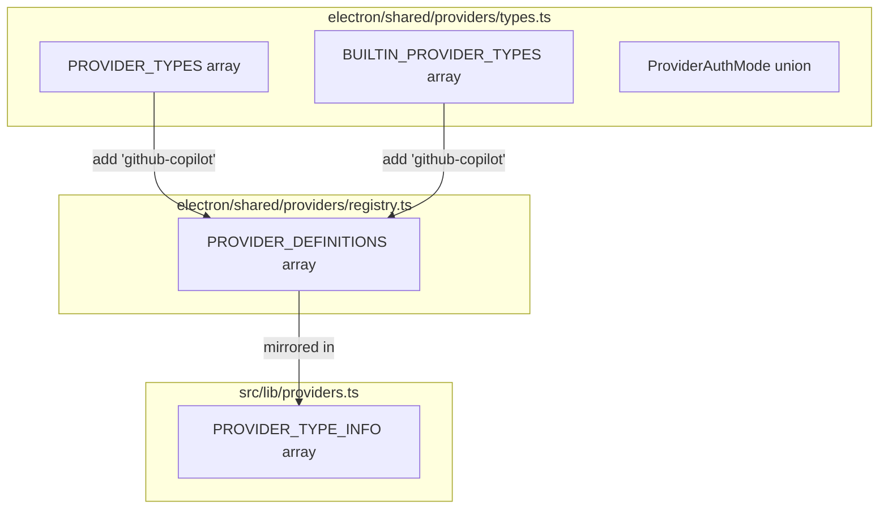

_Implements: REQ-1.1, REQ-1.2, REQ-1.3_

### DES-2: GitHub OAuth flow

Create a new utility `electron/utils/github-copilot-oauth.ts` that implements the GitHub Device Flow (RFC 8628). This flow uses GitHub's device authorization endpoint (`https://github.com/login/device/code`) to obtain a user code and verification URI, then polls the token endpoint until the user completes browser authorization.

Extend the `BrowserOAuthManager` in `electron/utils/browser-oauth.ts` to support `'github-copilot'` as a valid provider type. When `startFlow('github-copilot')` is called, it delegates to the new `loginGitHubCopilotOAuth()` function. The Device Flow emits `oauth:code` with `mode: 'device'` containing the `userCode` and `verificationUri` so the UI can display them, then polls for completion.

On success, `BrowserOAuthManager.onSuccess()` creates/updates a `ProviderAccount` with `authMode: 'oauth_browser'`, persists OAuth tokens in the secret store, and syncs to the OpenClaw runtime.

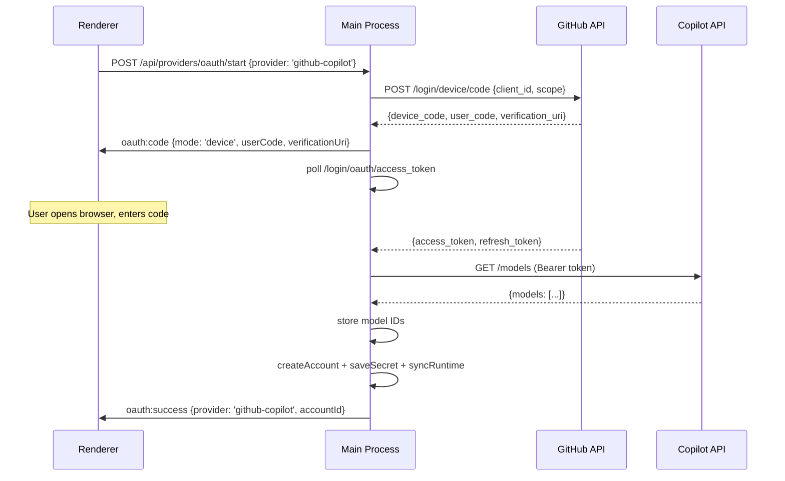

_Implements: REQ-2.1, REQ-2.2, REQ-2.3, REQ-2.4, REQ-2.5_

### DES-3: Model discovery

After a successful OAuth token exchange, `loginGitHubCopilotOAuth()` fetches `GET https://api.githubcopilot.com/models` using the access token. The response contains model objects with IDs.

The fetched model IDs are stored in `ProviderAccount.metadata.customModels` as a `string[]`. If the models endpoint fails, `COPILOT_FALLBACK_MODELS` provides a hardcoded list of common model IDs.

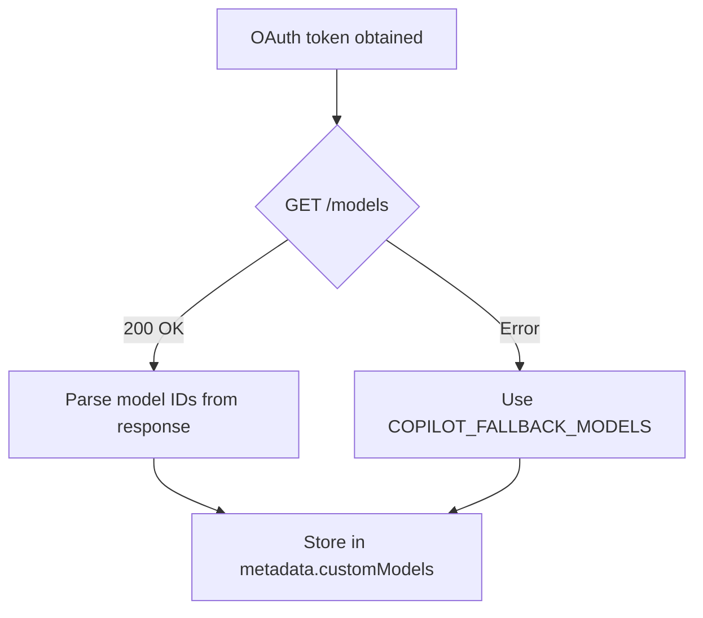

_Implements: REQ-3.1, REQ-3.2, REQ-3.3_

### DES-4: OAuth route dispatch extension

Extend the OAuth start route handler in `electron/api/routes/providers.ts` to recognize `'github-copilot'` and route it to `browserOAuthManager.startFlow('github-copilot')`. This follows the same pattern used for `'google'` and `'openai'`.

The `BrowserOAuthProviderType` union in `browser-oauth.ts` is extended to include `'github-copilot'`.

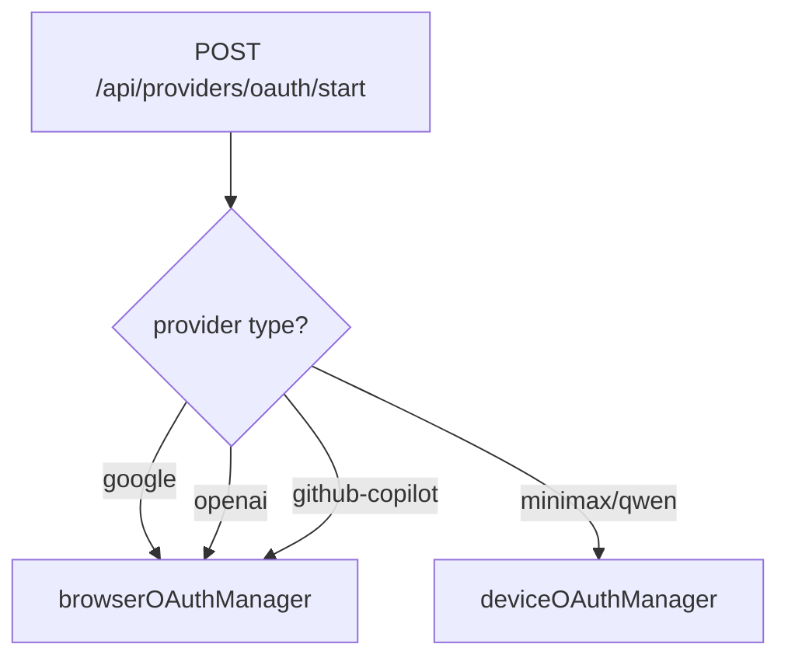

_Implements: REQ-2.2, REQ-4.1_

### DES-5: Provider lifecycle integration

The Copilot provider account follows the standard `ProviderAccount` lifecycle. Creating, updating, deleting, and setting as default all flow through the existing `ProviderService` and runtime sync functions. Token revocation on account deletion is handled by the existing `SecretStore.delete()` path that clears OAuth secrets by `accountId`.

No new lifecycle code is needed — the existing CRUD routes and runtime sync in `electron/api/routes/providers.ts` and `electron/services/providers/provider-runtime-sync.ts` already handle arbitrary provider types.

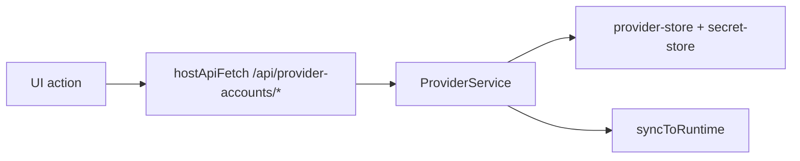

_Implements: REQ-4.1, REQ-4.2, REQ-4.3, REQ-4.4_

### DES-6: Frontend icon asset

Add a GitHub Copilot SVG icon to `src/assets/providers/` and register it in the `providerIcons` map in `src/assets/providers/index.ts`. The icon is a monochrome SVG following the same pattern as existing provider icons, and `shouldInvertInDark()` returns `true` for it (already the default for all providers).

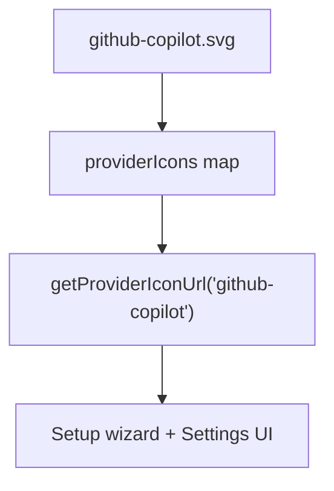

_Implements: REQ-1.3, REQ-5.1_

### DES-7: Model selector UI

The Copilot provider card in `ProvidersSettings` renders a `CopilotModelSelector` component when the provider is `github-copilot` and `metadata.customModels` is populated. The selector renders in **both view mode and edit mode** — the `!isEditing` guard is removed so model selection is always available.

The selector reads `metadata.customModels` (model IDs) and displays them in a flat list. The currently active model (`account.model`) is highlighted. Clicking a model updates the active model via the existing `updateAccount()` flow.

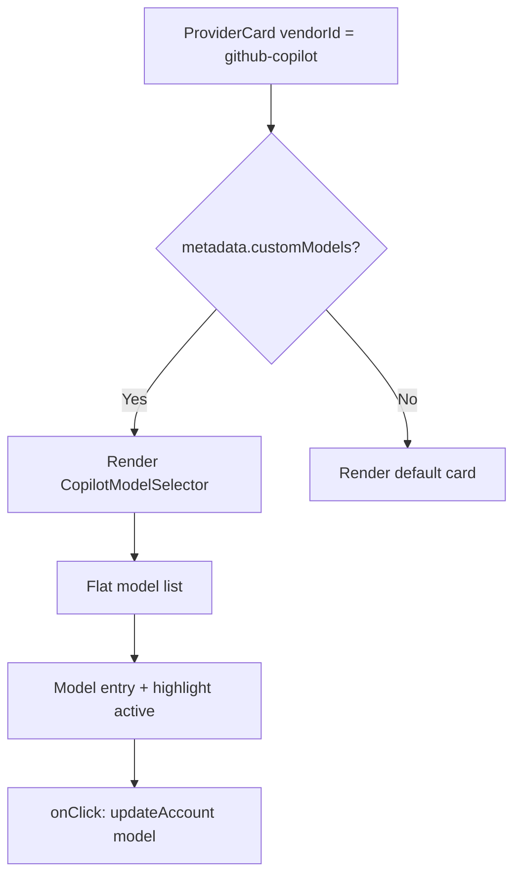

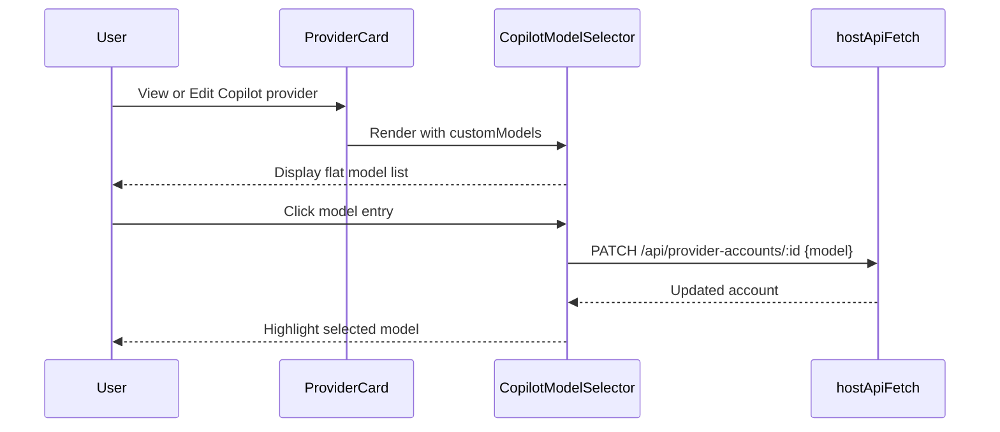

_Implements: REQ-6.1, REQ-6.2, REQ-6.3, REQ-6.4_

### DES-8: Tier classification removal

Remove all tier/multiplier classification artifacts from the existing Copilot provider implementation. The Copilot API does not return `is_premium`, `tier`, or `multiplier` fields, so the classification code produces incorrect results and must be deleted.

Specific removals:

| Artifact | File | Action |
|----------|------|--------|
| `CopilotModelEntry` type | `electron/utils/github-copilot-oauth.ts` | Delete type; replace all usages with `string` |
| `classifyModelTier()` function | `electron/utils/github-copilot-oauth.ts` | Delete function entirely |
| `COPILOT_FALLBACK_MODELS` type | `electron/utils/github-copilot-oauth.ts` | Change from `CopilotModelEntry[]` to `string[]` (plain IDs) |
| `fetchCopilotModels()` return type | `electron/utils/github-copilot-oauth.ts` | Change from `CopilotModelEntry[]` to `string[]` |
| `GitHubCopilotOAuthCredentials.models` type | `electron/utils/github-copilot-oauth.ts` | Change from `CopilotModelEntry[]` to `string[]` |
| `modelTiers` in `ProviderAccountMetadata` | `electron/shared/providers/types.ts` | Remove field from interface |
| `modelTiers` in frontend metadata | `src/lib/providers.ts` | Remove field from interface |
| `modelTiers` storage in `onSuccess()` | `electron/utils/browser-oauth.ts` | Remove the code that builds and stores `modelTiers` from model entries |
| Tier grouping/badges in selector | `src/components/settings/CopilotModelSelector.tsx` | Replace tier-grouped list with flat list; remove badge rendering |
| `!isEditing` guard on selector | `src/components/settings/ProvidersSettings.tsx` | Remove guard so selector renders in both view and edit mode |
| Tier-related test assertions | `tests/unit/` | Update tests to expect `string[]` models and flat list rendering |

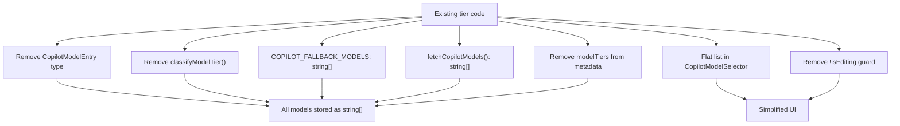

_Implements: REQ-7.1, REQ-7.2, REQ-7.3, REQ-7.4, REQ-7.5, REQ-7.6_

## Data Flow

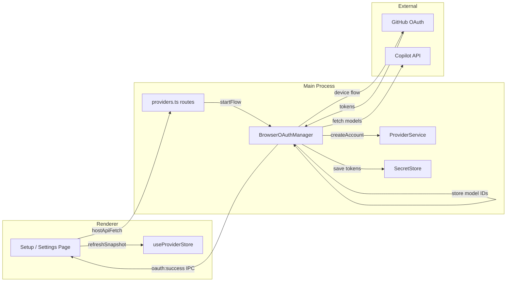

## Data Models

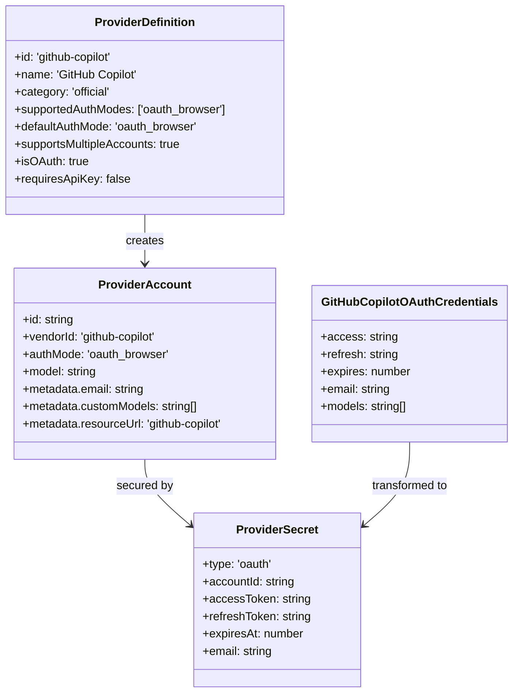

## Code Anatomy

| File Path | Purpose | Implements |
|-----------|---------|------------|
| `electron/shared/providers/types.ts` | Add `'github-copilot'` to `PROVIDER_TYPES` and `BUILTIN_PROVIDER_TYPES` | DES-1 |
| `electron/shared/providers/registry.ts` | Add `ProviderDefinition` entry for github-copilot | DES-1 |
| `src/lib/providers.ts` | Add `'github-copilot'` to frontend `PROVIDER_TYPES`, `BUILTIN_PROVIDER_TYPES`, and `PROVIDER_TYPE_INFO` | DES-1, DES-6 |
| `electron/utils/github-copilot-oauth.ts` | GitHub Device Flow OAuth + model fetch; export `COPILOT_FALLBACK_MODELS`, `fetchCopilotModels()` | DES-2, DES-3 |
| `electron/utils/browser-oauth.ts` | Extend `BrowserOAuthProviderType` and `startFlow`/`onSuccess` to handle `'github-copilot'`; store model IDs in account metadata | DES-2, DES-4 |
| `electron/api/routes/providers.ts` | Add `'github-copilot'` to OAuth start dispatch | DES-4 |
| `src/components/settings/CopilotModelSelector.tsx` | Flat model selector list; renders in both view and edit mode | DES-7 |
| `src/components/settings/ProvidersSettings.tsx` | Integrate `CopilotModelSelector` into `ProviderCard` for `github-copilot` vendor in both view and edit mode | DES-7 |
| `src/assets/providers/github-copilot.svg` | GitHub Copilot SVG icon | DES-6 |
| `src/assets/providers/index.ts` | Register copilot icon in `providerIcons` map | DES-6 |
| `electron/shared/providers/types.ts` | Remove `modelTiers` from `ProviderAccountMetadata` interface | DES-8 |
| `src/lib/providers.ts` | Remove `modelTiers` from frontend metadata interface | DES-8 |
| `tests/unit/` | Update test assertions from `CopilotModelEntry[]` to `string[]`; remove tier-related expectations | DES-8 |

## Error Handling

| Error Condition | Response | Recovery |
|-----------------|----------|----------|
| GitHub Device Flow timeout (user does not authorize) | Emit `oauth:error` with timeout message | User can retry via "Sign in with GitHub" button |
| GitHub OAuth token exchange failure | Emit `oauth:error` with error description | User can retry; error details logged |
| Copilot models endpoint returns error | Log warning, use fallback model list | Provider is still created with fallback models |
| User cancels OAuth flow | Emit `oauth:error` with cancellation message | UI returns to provider selection state |
| Access token expired during model fetch | Attempt token refresh, retry once | If refresh fails, use fallback models |

## Impact Analysis

| Affected Area | Impact Level | Notes |
|---------------|--------------|-------|
| `electron/shared/providers/types.ts` | Low | `ProviderType` union changes |
| `electron/shared/providers/registry.ts` | Low | Additive entry to `PROVIDER_DEFINITIONS` array |
| `electron/utils/browser-oauth.ts` | Medium | Extended type union and new branch in `executeFlow`/`onSuccess` |
| `electron/utils/github-copilot-oauth.ts` | High | Simplify to return `string[]` models; remove `CopilotModelEntry`, `classifyModelTier()`, tier logic |
| `electron/api/routes/providers.ts` | Low | New condition in OAuth dispatch |
| `src/lib/providers.ts` | Low | New entries in mirrored type arrays; remove `modelTiers` from metadata |
| `src/components/settings/ProvidersSettings.tsx` | Medium | `CopilotModelSelector` rendered in both view and edit mode (remove `!isEditing` guard) |
| `src/components/settings/CopilotModelSelector.tsx` | High | Simplify to flat list; remove tier grouping, badges, and multiplier display |
| `electron/shared/providers/types.ts` | Low | Remove `modelTiers` from `ProviderAccountMetadata` |
| `src/assets/providers/` | Low | New SVG file + map entry |

### Testing Requirements

| Test Type | Coverage Goal | Notes |
|-----------|---------------|-------|
| Unit | GitHub Device Flow OAuth utility | Mock GitHub API endpoints, test polling, timeout, and error paths |
| Unit | BrowserOAuthManager with github-copilot | Verify startFlow dispatches to correct handler |
| Unit | Provider registry | Verify `getProviderDefinition('github-copilot')` returns correct definition |
| Unit | Model discovery | Test model ID extraction from API response, fallback on error |
| Unit | CopilotModelSelector | Render flat model list, model selection, highlight active model; verify no tier badges or grouping |
| Unit | Tier removal verification | Verify `CopilotModelEntry` type no longer exists, `classifyModelTier` no longer exported, `modelTiers` not in metadata |
| Integration | OAuth route dispatch | Verify POST `/api/providers/oauth/start` with `github-copilot` triggers correct flow |
| E2E | Setup wizard | Verify GitHub Copilot appears in provider list during onboarding |
| E2E | Add Provider dialog | Verify GitHub Copilot appears and OAuth UI renders correctly |

### Dependencies

| Dependency | Type | Impact |
|------------|------|--------|
| GitHub Device Flow API | Runtime | Required for OAuth authentication |
| Copilot Chat Completions API | Runtime | Required for model discovery; fallback available |

### Risk Assessment

| Risk | Likelihood | Impact | Mitigation |
|------|------------|--------|------------|
| GitHub changes Device Flow endpoints | Low | High | Use well-documented stable endpoints; version-pin if needed |
| Copilot API models endpoint schema changes | Medium | Low | Defensive parsing with fallback model list |
| Access token scopes insufficient for Copilot API | Low | High | Request `read:user` and `copilot` scopes explicitly |

## Traceability Matrix

| Design Element | Requirements |
|----------------|--------------|
| DES-1 | REQ-1.1, REQ-1.2, REQ-1.3 |
| DES-2 | REQ-2.1, REQ-2.2, REQ-2.3, REQ-2.4, REQ-2.5 |
| DES-3 | REQ-3.1, REQ-3.2, REQ-3.3 |
| DES-4 | REQ-2.2, REQ-4.1 |
| DES-5 | REQ-4.1, REQ-4.2, REQ-4.3, REQ-4.4 |
| DES-6 | REQ-1.3, REQ-5.1 |
| DES-7 | REQ-6.1, REQ-6.2, REQ-6.3, REQ-6.4 |
| DES-8 | REQ-7.1, REQ-7.2, REQ-7.3, REQ-7.4, REQ-7.5, REQ-7.6 |
