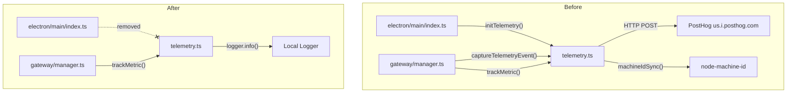
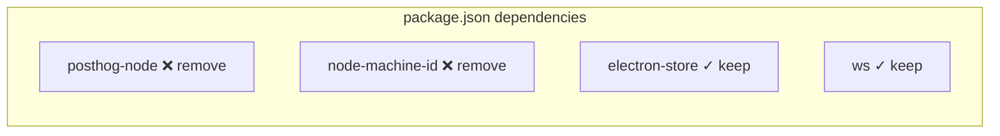
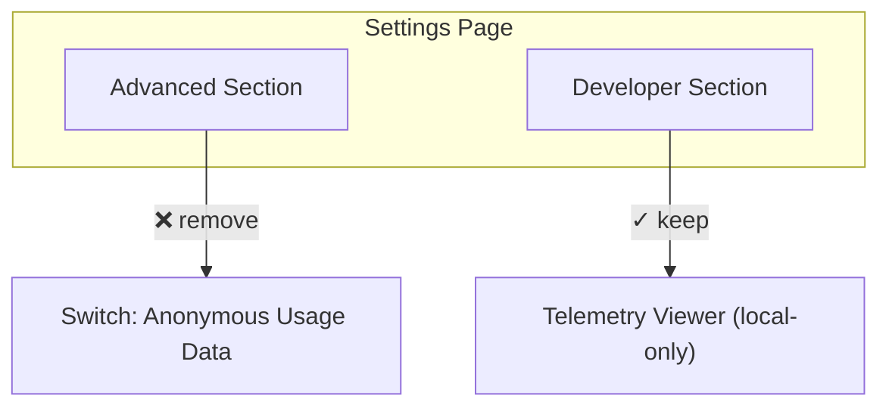
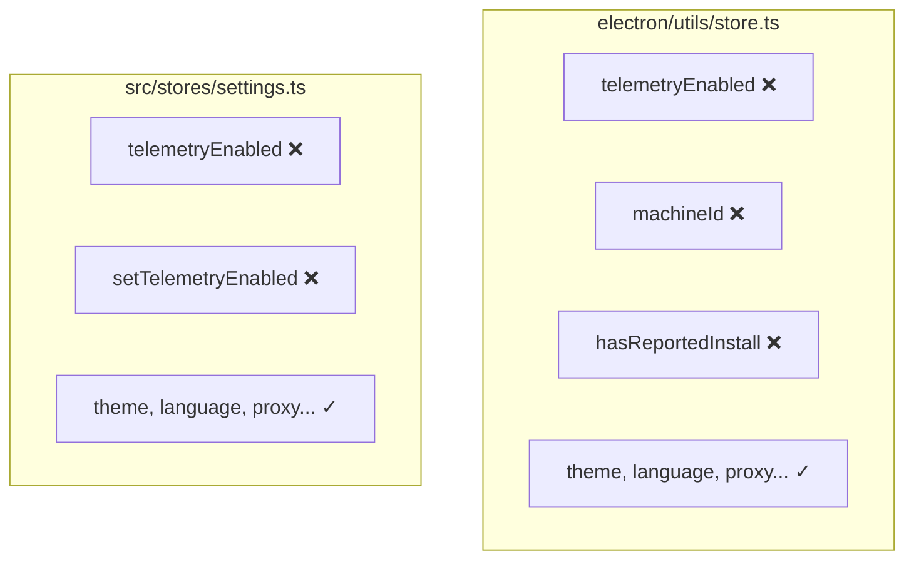
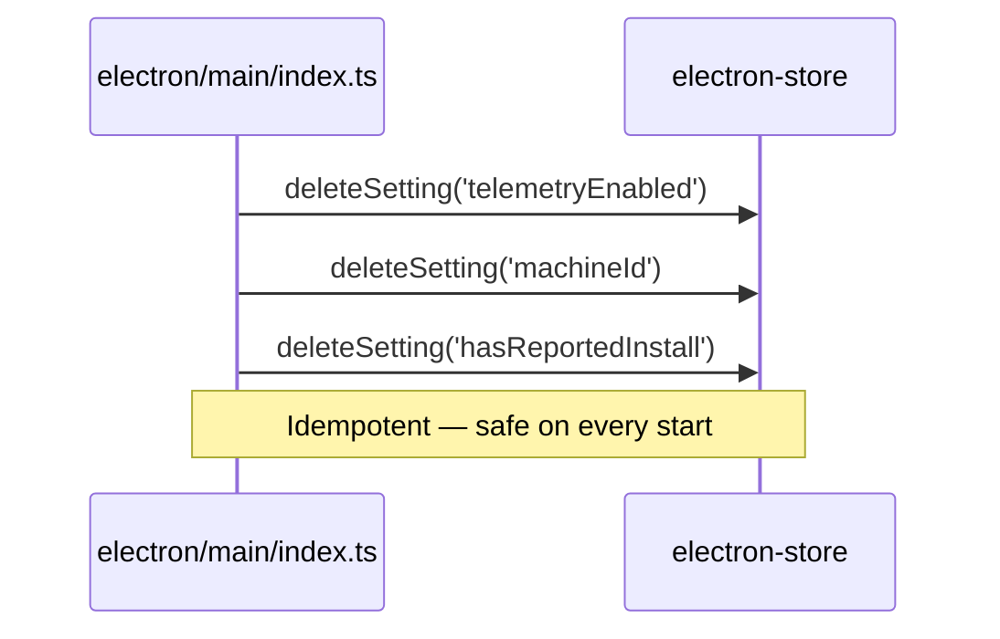
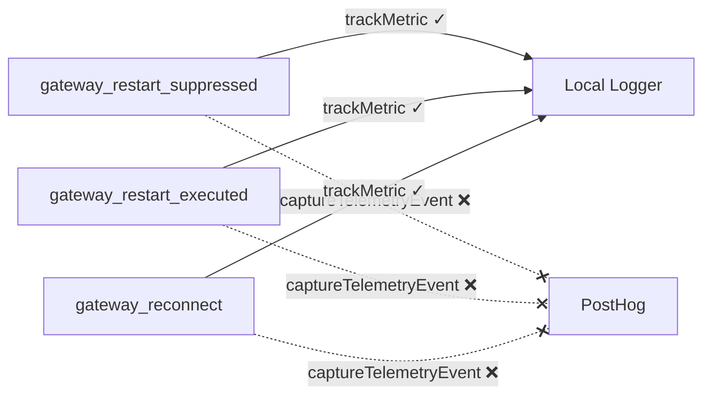
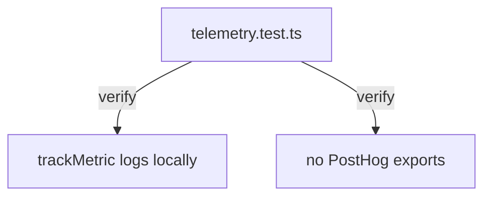
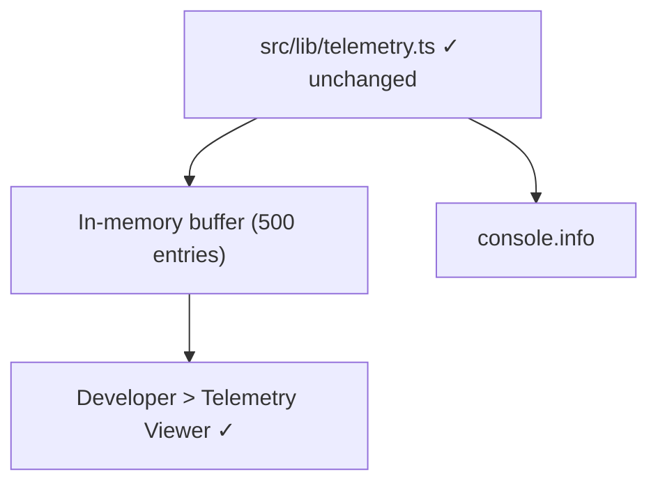

# Design Document

## Overview

This design removes all remote telemetry from ClawX by gutting the PostHog integration in `electron/utils/telemetry.ts`, removing the `posthog-node` and `node-machine-id` dependencies, eliminating the "Anonymous Usage Data" toggle from the Settings UI, and cleaning up persisted telemetry fields (`telemetryEnabled`, `machineId`, `hasReportedInstall`) from the electron-store configuration.

The local-only UI diagnostics module (`src/lib/telemetry.ts`) and the logger-only `trackMetric` function are preserved unchanged — they never transmit data externally and remain useful for developer debugging.

The approach is a clean removal: rather than adding feature flags or conditional paths, all PostHog-related code and dependencies are deleted. The `captureTelemetryEvent` call sites in `gateway/manager.ts` are replaced by existing `trackMetric` calls (local logger). The settings UI toggle is removed, and the Zustand store field is dropped. On upgrade, persisted telemetry artifacts are cleaned from the electron-store.

### Change Type

refactoring

### Design Goals

1. Completely eliminate remote data transmission to PostHog or any third-party service
2. Remove `posthog-node` and `node-machine-id` from the dependency tree
3. Remove the telemetry UI toggle and all associated state
4. Clean up persisted telemetry data on upgrade from previous versions
5. Preserve local-only diagnostic capabilities unchanged

### References

- **REQ-1**: Remove remote telemetry transmission
- **REQ-2**: Remove hardware-derived device fingerprinting
- **REQ-3**: Default telemetry to disabled
- **REQ-4**: Remove telemetry toggle from settings interface
- **REQ-5**: Require explicit opt-in consent for any future telemetry
- **REQ-6**: Clean up persisted telemetry artifacts
- **REQ-7**: Preserve local diagnostic capabilities

## System Architecture

### DES-1: Gut remote telemetry module

Replace the PostHog-based telemetry module (`electron/utils/telemetry.ts`) with a no-op implementation that preserves the `trackMetric` function signature (local logger) while removing `initTelemetry`, `captureTelemetryEvent`, and `shutdownTelemetry`. All PostHog client instantiation, API key constants, and `machineIdSync` calls are deleted.

The module retains its file path and `trackMetric` export so that existing `trackMetric` call sites in `gateway/manager.ts` continue to compile without changes. The removed exports (`initTelemetry`, `captureTelemetryEvent`, `shutdownTelemetry`) are deleted from the module completely — all import sites are updated accordingly.

_Implements: REQ-1.1, REQ-1.2, REQ-2.1_

### DES-2: Remove analytics dependencies

Remove `posthog-node` from `dependencies` and `node-machine-id` from `dependencies` in `package.json`. Run `pnpm install` to update the lockfile. No replacement libraries are added.

_Implements: REQ-1.3, REQ-2.2_

### DES-3: Remove telemetry toggle from Settings UI

Delete the "Anonymous Usage Data" Switch block from `src/pages/Settings/index.tsx` (the Advanced section). Remove the `telemetryEnabled` and `setTelemetryEnabled` destructured bindings from the `useSettingsStore` hook in that component. Remove the i18n keys `advanced.telemetry` and `advanced.telemetryDesc` from `en`, `zh`, and `ja` locale files (the `ja` locale is already missing them).

The Developer-mode "Telemetry Viewer" panel is **preserved** — it shows local-only diagnostics and is unrelated to remote PostHog telemetry.

_Implements: REQ-4.1_

### DES-4: Remove telemetryEnabled from state and store

Remove the `telemetryEnabled` field and `setTelemetryEnabled` method from the Zustand settings store (`src/stores/settings.ts`). Remove the `telemetryEnabled` field from the `AppSettings` interface and `createDefaultSettings()` in `electron/utils/store.ts`. Also remove `machineId` and `hasReportedInstall` fields from the same interface and defaults.

The settings API route (`electron/api/routes/settings.ts`) does not have telemetry-specific handling — it uses a generic key-value PUT. No changes needed there; the field simply stops existing.

_Implements: REQ-4.2, REQ-4.3, REQ-3.1, REQ-3.2_

### DES-5: Clean up persisted telemetry data on upgrade

Add a one-time migration in the app startup path (`electron/main/index.ts`) that checks for and deletes the `telemetryEnabled`, `machineId`, and `hasReportedInstall` keys from the electron-store if they exist. Use the existing `setSetting` / store API to delete these keys. This runs unconditionally on every start (idempotent delete) so it catches upgrades from any previous version.

_Implements: REQ-6.1_

### DES-6: Remove captureTelemetryEvent from gateway manager

Replace the three `captureTelemetryEvent(...)` calls in `electron/gateway/manager.ts` (lines ~416, ~437, ~981) with no-ops — the adjacent `trackMetric(...)` calls (local logger) are already present and provide the same observability without remote transmission. Remove the `captureTelemetryEvent` import.

_Implements: REQ-1.1_

### DES-7: Update tests

Replace the existing test in `tests/unit/telemetry.test.ts` (PostHog shutdown test) with a minimal test that verifies `trackMetric` logs locally and that the module does not export `initTelemetry`, `captureTelemetryEvent`, or `shutdownTelemetry`. Remove PostHog and node-machine-id mocks from the test.

_Implements: REQ-1.1, REQ-1.2, REQ-7.1, REQ-7.2_

### DES-8: Preserve local diagnostics unchanged

The in-memory UI telemetry module (`src/lib/telemetry.ts`) is not modified. All its exports (`trackUiEvent`, `trackUiTiming`, `startUiTiming`, `getUiTelemetrySnapshot`, `clearUiTelemetry`, `subscribeUiTelemetry`) remain available. The Developer-mode Telemetry Viewer in the Settings page continues to display local metrics.

_Implements: REQ-7.1, REQ-7.2_

## Code Anatomy

| File Path | Purpose | Implements |
|-----------|---------|------------|
| `electron/utils/telemetry.ts` | Gut module: keep only `trackMetric` (local logger) | DES-1 |
| `package.json` | Remove `posthog-node` and `node-machine-id` dependencies | DES-2 |
| `pnpm-lock.yaml` | Updated by `pnpm install` after dependency removal | DES-2 |
| `src/pages/Settings/index.tsx` | Remove "Anonymous Usage Data" toggle from Advanced section | DES-3 |
| `src/i18n/locales/en/settings.json` | Remove `advanced.telemetry` and `advanced.telemetryDesc` keys | DES-3 |
| `src/i18n/locales/zh/settings.json` | Remove `advanced.telemetry` and `advanced.telemetryDesc` keys | DES-3 |
| `src/stores/settings.ts` | Remove `telemetryEnabled` field and `setTelemetryEnabled` method | DES-4 |
| `electron/utils/store.ts` | Remove `telemetryEnabled`, `machineId`, `hasReportedInstall` from interface and defaults | DES-4 |
| `electron/main/index.ts` | Remove `initTelemetry` import/call; add persisted-data cleanup | DES-1, DES-5 |
| `electron/gateway/manager.ts` | Remove `captureTelemetryEvent` import and calls | DES-6 |
| `tests/unit/telemetry.test.ts` | Rewrite to test `trackMetric`-only module | DES-7 |
| `src/lib/telemetry.ts` | No changes (local diagnostics preserved) | DES-8 |

## Impact Analysis

| Affected Area | Impact Level | Notes |
|---------------|--------------|-------|
| `electron/utils/telemetry.ts` | High | Module rewritten — 3 exports removed, 1 retained |
| `electron/main/index.ts` | Medium | Remove `initTelemetry` call, add cleanup migration |
| `electron/gateway/manager.ts` | Low | Remove 3 `captureTelemetryEvent` calls; `trackMetric` stays |
| `src/pages/Settings/index.tsx` | Medium | UI element and store bindings removed |
| `src/stores/settings.ts` | Medium | State field and setter removed |
| `electron/utils/store.ts` | Medium | 3 fields removed from interface and defaults |
| `package.json` + `pnpm-lock.yaml` | Medium | 2 dependencies removed |
| `tests/unit/telemetry.test.ts` | High | Test rewritten for new module shape |
| i18n locales (en, zh) | Low | 2 keys removed per locale |

### Dependencies

| Dependency | Type | Impact |
|------------|------|--------|
| `posthog-node` | Runtime (removed) | No replacement needed — all remote sending is eliminated |
| `node-machine-id` | Runtime (removed) | No replacement needed — device fingerprinting is eliminated |

### Testing Requirements

| Test Type | Coverage Goal | Notes |
|-----------|---------------|-------|
| Unit | `trackMetric` logs correctly | Rewrite `telemetry.test.ts` |
| Unit | Settings store no longer has `telemetryEnabled` | Update `stores.test.ts` if affected |
| Integration | App starts without telemetry initialization | Verify no PostHog errors in startup |
| Manual | Settings page shows no telemetry toggle | Visual verification |

## Traceability Matrix

| Design Element | Requirements |
|----------------|--------------|
| DES-1 | REQ-1.1, REQ-1.2, REQ-2.1 |
| DES-2 | REQ-1.3, REQ-2.2 |
| DES-3 | REQ-4.1 |
| DES-4 | REQ-3.1, REQ-3.2, REQ-4.2, REQ-4.3 |
| DES-5 | REQ-6.1 |
| DES-6 | REQ-1.1 |
| DES-7 | REQ-1.1, REQ-1.2, REQ-7.1, REQ-7.2 |
| DES-8 | REQ-7.1, REQ-7.2 |
